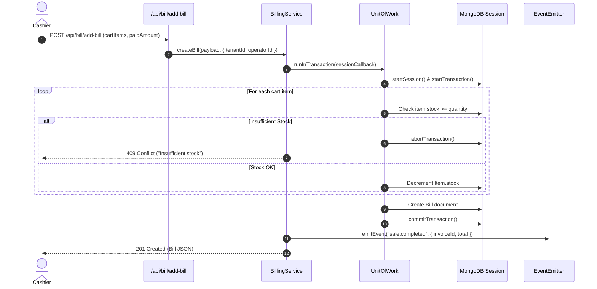

<div align="center">

# ⚙️ Hardware Point POS — Backend Architecture & Server Guide

### Modular Enterprise REST API Built with Node.js, Express 5, MongoDB Atlas & Clean Architecture

<p>
  
  
  
  
  
  
</p>

</div>

---

## 📌 Executive Summary

The Hardware Point POS backend is an enterprise-grade retail API built on **Express 5** and **Mongoose 8** with a modular Clean Architecture. It delivers multi-tenant context resolution, cryptographic token signing via **Jose JWT**, strict capability-based Role-Based Access Control (RBAC), atomic database transactions using the **Unit of Work** pattern, decoupled event-driven domain pub/sub via **EventEmitter**, and pluggable Strategy patterns for receipt layout formatting and multi-regional tax calculation.

---

## 🏛️ Modular Core & Feature Architecture

The backend repository is organized into a shared **Core** infrastructure and independent **Feature Modules**:

```
server/
├── app.js                         # Express 5 application factory with dependency injection
├── server.js                      # HTTP server lifecycle, graceful shutdown & Google DNS resolvers
├── seeders.js                     # Multi-tenant catalog, user & store seeder script
├── package.json                   # Backend dependencies & npm run scripts
└── src/
    ├── core/                      # Shared enterprise cross-cutting concerns
    │   ├── database/              # Mongoose connection pool, tenant manager & Unit of Work
    │   │   ├── connection.js      # Robust MongoDB Atlas connection with auto-retry
    │   │   ├── tenantManager.js   # Multi-tenant context and scoped query helpers
    │   │   └── unitOfWork.js      # ACID transaction runner across replica set sessions
    │   ├── errors/                # Structured AppError hierarchy & centralized errorHandler
    │   │   ├── AppError.js        # BadRequest, Unauthorized, Forbidden, NotFound, Conflict
    │   │   └── errorHandler.js    # Global error interceptor with status codes and logs
    │   ├── events/                # Internal domain pub/sub bus & event types
    │   │   ├── eventEmitter.js    # AppEvents EventEmitter instance with safe logging
    │   │   └── eventTypes.js      # SALE_COMPLETED, SALE_VOIDED, STOCK_LOW, USER_CREATED
    │   ├── middlewares/           # HTTP interceptors
    │   │   ├── authenticate.js    # Bearer Jose JWT validation & user injection
    │   │   ├── requirePermission.js # Role & capability authorization checks
    │   │   ├── tenantResolver.js  # Multi-tenant header/subdomain context extraction
    │   │   └── validateRequest.js # Request body schema validation middleware
    │   ├── models/                # Mongoose schemas with soft delete & indexing
    │   │   ├── Bill.js            # Invoice records, customer details, cart array, audit log
    │   │   ├── Charge.js          # Store operational expenses and overhead charges
    │   │   ├── Dealer.js          # Suppliers, vendors, contacts, and product lines
    │   │   ├── Item.js            # Catalog products, stock units, SKU, barcode, reorder level
    │   │   ├── Tenant.js          # Multi-tenant store configuration, tax strategy, receipt format
    │   │   ├── User.js            # Operator credentials, hashed passwords, roles, permissions
    │   │   └── plugins/
    │   │       └── softDelete.js  # Generic soft-delete plugin with deletedAt, deletedBy
    │   ├── security/              # Cryptographic token signing & verification
    │   │   └── JoseTokenSigner.js # Compact JWT signing with HS256 algorithm via Jose
    │   └── seedData/              # Seed fixtures for retail hardware products
    │       └── items.js           # 20+ realistic hardware and plumbing catalog items
    ├── modules/                   # Domain feature modules (Routes, Controllers, Services)
    │   ├── auth/                  # Authentication & operator self-registration
    │   │   ├── auth.controller.js # Login, register, and resetPassword handlers
    │   │   ├── auth.routes.js     # /api/users/login, /register, /reset-password
    │   │   └── auth.service.js    # Credential validation, Bcrypt hashing, token issuance
    │   ├── billing/               # Invoicing, checkout transactions & audit logs
    │   │   ├── billing.controller.js # Invoices, receipts, voiding, and deletions
    │   │   ├── billing.routes.js  # /api/bill routes with RBAC guards
    │   │   └── billing.service.js # Atomic checkout transactions, stock depletion & restoration
    │   ├── expenses/              # Store charges & vendor supply chain
    │   │   ├── charges.controller.js # Expense entries, categories, and totals
    │   │   ├── charges.service.js    # Expense persistence and queries
    │   │   ├── dealers.controller.js # Supplier CRUD handlers
    │   │   ├── dealers.service.js    # Supplier persistence and queries
    │   │   └── expenses.routes.js    # /api/dealers and /api/charges routes
    │   ├── inventory/             # Product catalog, stock tracking & audits
    │   │   ├── inventory.controller.js # Item search, add, edit, soft-delete, audit trail
    │   │   ├── inventory.routes.js     # /api/items routes with RBAC guards
    │   │   └── inventory.service.js    # Catalog management and stock alerts
    │   └── tenant-admin/          # User administration & store settings
    │       ├── tenant.controller.js    # User management & tenant settings handlers
    │       ├── tenant.routes.js        # /api/users (admin) and /api/tenant routes
    │       └── tenant.service.js       # Operator provisioning, status toggle, role change
    └── strategies/                # Pluggable GoF Strategy implementations
        ├── receipts/              # Receipt document formatting strategies
        │   ├── IReceiptStrategy.js         # Abstract receipt strategy contract
        │   ├── ReceiptStrategyFactory.js   # Factory resolving thermal80mm / standardA4
        │   ├── StandardA4ReceiptStrategy.js# Clean A4 tax invoice formatter
        │   └── Thermal80mmReceiptStrategy.js # 80mm roll receipt formatter
        └── tax/                   # Tax computation strategies
            ├── ITaxStrategy.js             # Abstract tax calculation contract
            ├── TaxStrategyFactory.js       # Factory resolving zero / flat / vat
            ├── FlatTaxStrategy.js          # Flat percentage applied to gross subtotal
            ├── VatTaxStrategy.js           # Line-item VAT computation
            └── ZeroTaxStrategy.js          # Zero-rated / tax exempt computation
```

---

## 🔐 Security, Authentication & RBAC

The API uses **Jose** to issue compact JSON Web Tokens (`HS256`) containing the operator's ID, role, tenant, and effective capabilities.

### Capability Matrix by System Role

| Capability | Cashier | Manager | Administrator | Description |
|---|:---:|:---:|:---:|---|
| `pos:checkout` | ✅ | ✅ | ✅ | Issue invoices and finalize sales transactions |
| `bills:read` | ✅ | ✅ | ✅ | View invoices and generate thermal/A4 receipts |
| `bills:edit` | ❌ | ✅ | ✅ | Update customer info or payment mode on invoices |
| `bills:void` | ❌ | ✅ | ✅ | Void transaction, trigger stock restoration, view audit log |
| `bills:delete` | ❌ | ❌ | ✅ | Permanently hard-delete invoice records |
| `catalog:read` | ✅ | ✅ | ✅ | Read product catalog, prices, and stock units |
| `catalog:manage` | ❌ | ✅ | ✅ | Add new products, update prices, adjust inventory |
| `catalog:delete` | ❌ | ✅ | ✅ | Soft-delete products and view deleted audit trail |
| `expenses:manage` | ❌ | ✅ | ✅ | Record operational store expenses and utility bills |
| `dealers:manage` | ❌ | ✅ | ✅ | Manage supplier and vendor contact directory |
| `analytics:read` | ❌ | ✅ | ✅ | View stock analytics, COGS, gross & net margins |
| `users:manage` | ❌ | ❌ | ✅ | Provision operators, toggle active status, change roles |
| `tenant:config` | ❌ | ❌ | ✅ | Configure store name, tax strategy, receipt templates |

---

## 🔄 Transactional Unit of Work (ACID Guarantee)

All operations that alter stock during sales checkout or invoice voiding execute within an atomic **Unit of Work** (`unitOfWork.js`) backed by MongoDB Client Sessions:



---

## 📡 Exhaustive REST API Route Catalog

All routes reside under the `/api` namespace with standard JSON request and response contracts.

### 1. Health & Diagnostics

| Endpoint | Method | Auth | Capability | Description |
|---|---|---|---|---|
| `/health` | `GET` | Public | None | Server uptime, status, and ISO timestamp |

---

### 2. Authentication & User Management (`/api/users`)

| Endpoint | Method | Auth | Capability | Body Payload | Response |
|---|---|---|---|---|---|
| `/api/users/login` | `POST` | Public | None | `{ "userId": "admin", "password": "..." }` | `200 OK` with `{ token, user }` |
| `/api/users/register` | `POST` | Public | None | `{ "name": "John", "password": "..." }` | `201 Created` with generated `userId` |
| `/api/users/reset-password` | `POST` | Public | None | `{ "userId": "...", "name": "...", "newPassword": "..." }` | `200 OK` `{ success: true }` |
| `/api/users/get-users` | `GET` | Bearer | `users:manage` | None | `200 OK` User array |
| `/api/users/admin-create` | `POST` | Bearer | `users:manage` | `{ "name": "...", "password": "...", "role": "cashier" }` | `201 Created` User object |
| `/api/users/toggle-status` | `PATCH` | Bearer | `users:manage` | `{ "userId": "1001", "active": false }` | `200 OK` User object |
| `/api/users/update-role` | `PATCH` | Bearer | `users:manage` | `{ "userId": "1001", "role": "manager" }` | `200 OK` User object |
| `/api/users/delete/:userId` | `DELETE`| Bearer | `users:manage` | None | `200 OK` `{ message: "User deleted" }` |

---

### 3. Inventory & Catalog (`/api/items`)

| Endpoint | Method | Auth | Capability | Body Payload / Params | Response |
|---|---|---|---|---|---|
| `/api/items/get-item` | `GET` | Optional | `catalog:read` | Query: `?search=...&category=...` | `200 OK` Items array |
| `/api/items/:id` | `GET` | Optional | `catalog:read` | Param: `:id` | `200 OK` Item object |
| `/api/items/deleted` | `GET` | Bearer | `catalog:manage` | None | `200 OK` Soft-deleted items |
| `/api/items/add-item` | `POST` | Bearer | `catalog:manage` | `{ "name": "...", "purchasePrice": 100, "salePrice": 150, "stock": 50, "category": "Pipe" }` | `201 Created` Item object |
| `/api/items/edit-item` | `PUT` | Bearer | `catalog:manage` | `{ "itemId": "...", "salePrice": 160, "stock": 45 }` | `200 OK` Item object |
| `/api/items/delete-item`| `POST` | Bearer | `catalog:manage` | `{ "itemId": "..." }` | `200 OK` Soft-deleted record |
| `/api/items/:id` | `DELETE`| Bearer | `catalog:manage` | Param: `:id`, Optional `?hard=true` (Admin) | `200 OK` Deleted response |

---

### 4. Invoices & Billing (`/api/bill`)

| Endpoint | Method | Auth | Capability | Body Payload / Params | Response |
|---|---|---|---|---|---|
| `/api/bill/get-bill` | `GET` | Optional | `bills:read` | Query: `?search=...&paymentMethod=...` | `200 OK` Invoices array |
| `/api/bill/:id` | `GET` | Optional | `bills:read` | Param: `:id` | `200 OK` Invoice object |
| `/api/bill/:id/receipt` | `GET` | Optional | `bills:read` | Param: `:id` | `200 OK` Formatted receipt data |
| `/api/bill/voided` | `GET` | Bearer | `bills:void` | None | `200 OK` Voided audit logs |
| `/api/bill/add-bill` | `POST` | Optional | `pos:checkout` | `{ "cartItems": [...], "paidAmount": 1500, "paymentMethod": "cash", "costumerName": "Ali" }` | `201 Created` Bill object |
| `/api/bill/edit-bill` | `PUT` | Bearer | `bills:edit` | `{ "billId": "...", "costumerName": "...", "paidAmount": 1500 }` | `200 OK` Bill object |
| `/api/bill/void-bill/:id` | `POST`| Bearer | `bills:void` | Param: `:id` | `200 OK` Restored stock + Voided bill |
| `/api/bill/delete-bill/:id`| `DELETE`| Bearer | `bills:delete` | Param: `:id` | `200 OK` Deleted response |

---

### 5. Suppliers & Dealers (`/api/dealers`)

| Endpoint | Method | Auth | Capability | Body Payload | Response |
|---|---|---|---|---|---|
| `/api/dealers/get-dealers` | `GET` | Optional | None | Query: `?search=...` | `200 OK` Dealers array |
| `/api/dealers/add-dealer` | `POST` | Bearer | `dealers:manage` | `{ "dealerName": "Atlas", "contactName": "Tariq", "shopName": "Shop 4", "address": "Market" }` | `201 Created` Dealer object |
| `/api/dealers/edit-dealer` | `PUT` | Bearer | `dealers:manage` | `{ "dealerId": "...", ... }` | `200 OK` Dealer object |
| `/api/dealers/delete-dealer`| `POST` | Bearer | `dealers:manage` | `{ "dealerId": "..." }` | `200 OK` Soft-deleted record |

---

### 6. Store Expenses (`/api/charges`)

| Endpoint | Method | Auth | Capability | Body Payload | Response |
|---|---|---|---|---|---|
| `/api/charges/get-charges` | `GET` | Optional | None | Query: `?search=...` | `200 OK` Charges array |
| `/api/charges/add-charge` | `POST` | Bearer | `expenses:manage` | `{ "description": "Electric Bill", "amount": 4500, "date": "2026-09-13" }` | `201 Created` Charge object |
| `/api/charges/edit-charge` | `PUT` | Bearer | `expenses:manage` | `{ "chargeId": "...", ... }` | `200 OK` Charge object |
| `/api/charges/delete-charge`| `POST` | Bearer | `expenses:manage` | `{ "chargeId": "..." }` | `200 OK` Soft-deleted record |

---

### 7. Tenant Store Configuration (`/api/tenant`)

| Endpoint | Method | Auth | Capability | Body Payload | Response |
|---|---|---|---|---|---|
| `/api/tenant/settings` | `GET` | Bearer | `tenant:config` | None | `200 OK` Tenant settings JSON |
| `/api/tenant/settings` | `PUT` | Bearer | `tenant:config` | `{ "name": "Hardware Point", "taxStrategy": "zero", "receiptTemplate": "thermal80mm" }` | `200 OK` Updated tenant |

---

## 🛠️ Environment Variables (.env)

Create `.env.local` inside `server/` using the following blueprint:

```ini
# Server Listening Port
PORT=8080

# Environment Mode (development | production | test)
NODE_ENV=development

# MongoDB Connection String (Atlas SRV or Local Replica Set)
MONGO_URI=mongodb+srv://<username>:<password>@cluster0.mongodb.net/pos-mern?retryWrites=true&w=majority

# Jose JWT Secret Key (Cryptographic string)
JWT_SECRET=super-secure-jwt-secret-key-change-in-production

# Jose JWT Token Lifespan (e.g. 8h, 24h, 7d)
JWT_EXPIRES_IN=8h

# Default Multi-Tenant Identifier
DEFAULT_TENANT_ID=default-store
```

---

## 🚀 Server Startup & Seeding

```bash
# 1. Install dependencies
npm install

# 2. Seed default items, master admin, and store settings
npm run seed

# 3. Start development server with Nodemon auto-reload
npm run dev

# 4. Or start production server
npm start
```
