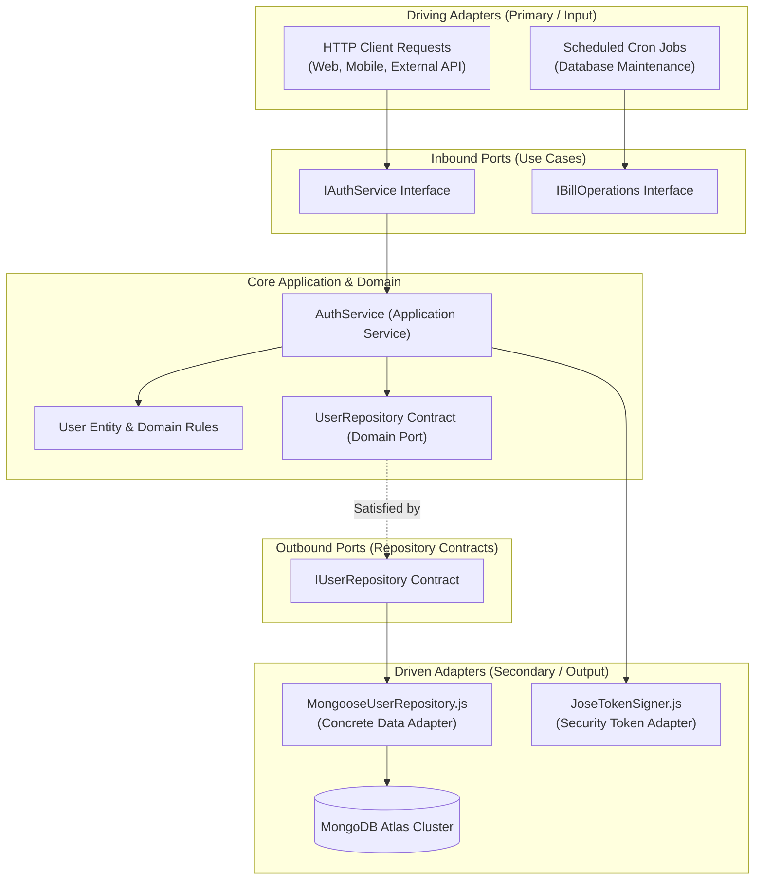
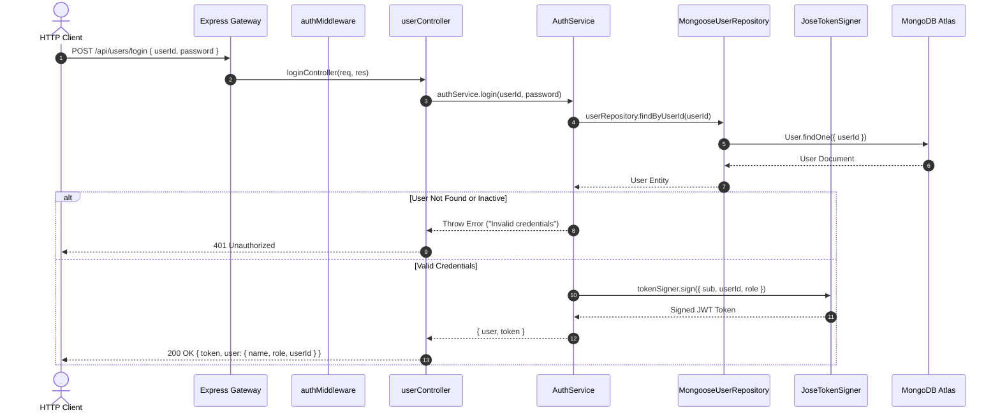
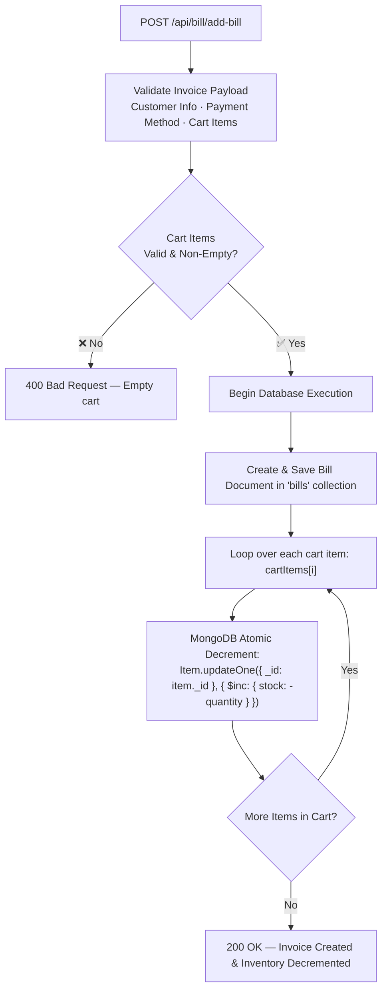
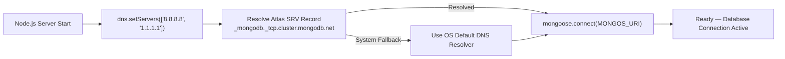

<div align="center">

# ⚙️ Hardware Point POS — Backend Architecture & Server Guide

### Enterprise REST API Built with Node.js, Express, MongoDB Atlas & Domain-Driven Design (DDD)

<p>
  
  
  
  
  
  
</p>

</div>

---

## 🏛️ Domain-Driven Design (DDD) & Layered Backend

The server adopts a clean, layered architecture inspired by Domain-Driven Design and Hexagonal (Ports & Adapters) principles:

```
┌─────────────────────────────────────────────────────────────────────────────────────────────┐
│                             PRESENTATION LAYER (src/presentation/)                          │
│  • Express Routers: userRoutes.js · itemRoutes.js · billRoutes.js · dealerRoutes.js         │
│  • Controllers: userController.js · itemController.js · billController.js · etc.           │
│  • Middleware: authMiddleware.js (JWT Bearer Verification & Role Authorization)             │
└──────────────────────────────────────────────┬──────────────────────────────────────────────┘
                                               │ calls use cases
┌──────────────────────────────────────────────▼──────────────────────────────────────────────┐
│                             APPLICATION LAYER (src/application/)                            │
│  • AuthService.js: Login, Operator Provisioning, Status Toggling, Role Updates              │
│  • Orchestrates business use cases independently of HTTP transport or framework APIs       │
└──────────────────────────────────────────────┬──────────────────────────────────────────────┘
                                               │ defines contracts (DIP)
┌──────────────────────────────────────────────▼──────────────────────────────────────────────┐
│                                DOMAIN LAYER (src/domain/)                                   │
│  • RepositoryContracts.js: Abstract UserRepository contract defining entity operations      │
│  • Entities & Value Objects: Core enterprise models free of database driver dependencies    │
└──────────────────────────────────────────────▲──────────────────────────────────────────────┘
                                               │ implements contracts
┌──────────────────────────────────────────────┴──────────────────────────────────────────────┐
│                           INFRASTRUCTURE LAYER (src/infrastructure/)                        │
│  • MongooseUserRepository.js: Concrete database persistence using Mongoose ODM              │
│  • JoseTokenSigner.js: Cryptographic JWT signing and token validation                      │
│  • config/config.js: DNS Fallback Resolver (8.8.8.8) & Mongoose Connection Pool             │
└──────────────────────────────────────────────┬──────────────────────────────────────────────┘
                                               │ TLS SRV Pool
                                    ┌──────────▼──────────┐
                                    │    MONGODB ATLAS    │
                                    │      pos-mern       │
                                    └─────────────────────┘
```

---

## 📊 Mermaid Architectural Diagrams

### 1. Hexagonal Ports & Adapters Flow



---

### 2. Request-Response Pipeline



---

### 3. Inventory Decrement & Stock Integrity Flow



---

### 4. MongoDB Atlas DNS Fallback Resolver

When running on certain network providers or corporate firewalls, DNS SRV resolution for MongoDB Atlas (`mongodb+srv://`) can throw `querySrv ECONNREFUSED`.

[`config/config.js`](file:///d:/mern-pos/server/config/config.js) injects Google and Cloudflare DNS servers into Node's runtime resolver before initializing the Mongoose connection pool:



---

## 📂 Server Directory Structure

```
📂 server/
├── 📄 .env.example                               # Server environment blueprint
├── 📄 package.json                               # Dependencies & scripts
├── 📄 server.js                                  # HTTP Server entry point (Port 8080)
├── 📄 seeders.js                                 # Seeds master admin & sample cashier
├── 📄 README.md                                  # Backend architectural documentation
├── 📁 config/
│   └── 📄 config.js                              # Mongoose connection with DNS SRV resolver
└── 📁 src/                                       # Domain-Driven Clean Architecture
    ├── 📁 domain/                                # Core Business Domain & Interfaces
    │   └── 📁 repositories/
    │       └── 📄 RepositoryContracts.js         # UserRepository abstract contract
    ├── 📁 application/                           # Application Use Cases
    │   └── 📁 services/
    │       └── 📄 AuthService.js                 # Login, user list, provisioning use cases
    ├── 📁 infrastructure/                        # Technical Implementations
    │   ├── 📁 repositories/
    │   │   └── 📄 MongooseUserRepository.js      # Concrete Mongoose implementation of contract
    │   └── 📁 security/
    │       └── 📄 JoseTokenSigner.js             # JWT signing & verification service
    └── 📁 presentation/                          # Web Layer & HTTP Transport
        ├── 📁 controllers/                       # Request Handlers
        │   ├── 📄 userController.js              # Auth & admin operator HTTP controllers
        │   ├── 📄 itemController.js              # Inventory catalog CRUD controllers
        │   ├── 📄 billController.js              # Invoicing & checkout controllers
        │   ├── 📄 dealerController.js            # Wholesale supplier controllers
        │   └── 📄 chargesController.js           # Operational expense controllers
        ├── 📁 middleware/                        # Express Middlewares
        │   └── 📄 authMiddleware.js              # verifyToken & requireRole authorization
        └── 📁 routes/                            # Express Route Definitions
            ├── 📄 userRoutes.js                  # /api/users router & aliases
            ├── 📄 itemRoutes.js                  # /api/items router
            ├── 📄 billRoutes.js                  # /api/bill router
            ├── 📄 dealerRoutes.js                # /api/dealers router
            └── 📄 chargesRoutes.js               # /api/charges router
```

---

## 🔐 Seeded Accounts & Permissions

The database seeder ([`seeders.js`](file:///d:/mern-pos/server/seeders.js)) provisions the following standard operator accounts:

```bash
npm run seed
```

| User ID | Password | Role | Display Name | Permissions |
|---|---|---|---|---|
| **`admin`** | `test123` | `admin` | `haider ali` | Full administrative control, user provisioning, revenue analytics |
| **`1001`** | `test123` | `cashier` | `Counter Cashier` | Front-desk cash register operator |

---

## 📡 REST API Route Reference

### 1. User & Operator Administration (`/api/users`)

| Method | Endpoint | Authorization | Roles | Description |
|---|---|:---:|:---:|---|
| `POST` | `/login` | Public | All | Authenticate and receive signed JWT token |
| `POST` | `/register` | Public | All | Register new account (if self-registration enabled) |
| `POST` | `/reset-password` | Public | All | Reset password using security verification |
| `GET` | `/get-users` | ✅ Required | `admin` | Retrieve all operator accounts (with `/all` alias) |
| `POST` | `/admin-create` | ✅ Required | `admin` | Create a new operator account |
| `PATCH` | `/toggle-status` | ✅ Required | `admin` | Toggle operator active/suspended state (`{ userId, active }`) |
| `PATCH` | `/update-role` | ✅ Required | `admin` | Update operator role (`{ userId, role }`) |
| `DELETE` | `/delete/:userId` | ✅ Required | `admin` | Delete operator account |

### 2. Product Catalog (`/api/items`)

| Method | Endpoint | Auth | Description |
|---|---|:---:|---|
| `GET` | `/get-item` | Public | Fetch product catalog with live stock counts |
| `POST` | `/add-item` | Public | Add new inventory item to catalog |
| `PUT` | `/edit-item` | Public | Update item details, prices, or reorder threshold |
| `POST` | `/delete-item` | Public | Delete inventory product |

### 3. Invoices & Billing (`/api/bill`)

| Method | Endpoint | Auth | Description |
|---|---|:---:|---|
| `GET` | `/get-bill` | Public | Retrieve all customer billing records |
| `POST` | `/add-bill` | Public | Create invoice and decrement purchased item stock |
| `PUT` | `/edit-bill` | Public | Update customer info or payment status |
| `DELETE` | `/delete-bill/:id` | Public | Delete invoice record |

### 4. Wholesale Vendors (`/api/dealers`)

| Method | Endpoint | Auth | Description |
|---|---|:---:|---|
| `GET` | `/get-dealers` | Public | List all vendor and supplier profiles |
| `POST` | `/add-dealer` | Public | Register a new wholesale supplier |
| `PUT` | `/edit-dealer` | Public | Update supplier contact information |
| `POST` | `/delete-dealer` | Public | Remove vendor profile |

### 5. Operating Expenses (`/api/charges`)

| Method | Endpoint | Auth | Description |
|---|---|:---:|---|
| `GET` | `/get-charges` | Public | Fetch all recorded operating expenses |
| `POST` | `/add-charge` | Public | Record a new expense line |
| `PUT` | `/edit-charge` | Public | Update expense record |
| `POST` | `/delete-charge` | Public | Delete expense entry |

---

## ⚙️ Configuration & Available Scripts

Create `.env` using `.env.example`:
```bash
cp .env.example .env
```

| Variable | Required | Default | Purpose |
|---|:---:|---|---|
| `PORT` | ❌ | `8080` | Express HTTP listen port |
| `MONGOS_URI` | ✅ | — | MongoDB Atlas SRV connection string |
| `JWT_SECRET` | ✅ | — | Private cryptographic key for JWT signing |
| `JWT_EXPIRES_IN` | ❌ | `8h` | Token expiration duration |

### Command Scripts

```bash
# Start backend server in development with nodemon
npm start

# Execute database seeder
npm run seed
```

---

## 🤝 Contributing

Contributions must follow the Domain-Driven Design layering. Please review root [`CONTRIBUTING.md`](file:///d:/mern-pos/CONTRIBUTING.md).

---

## 📄 License

This backend is governed by the **Hardware Point POS Permission-Based Non-Commercial License**. Free for personal/educational evaluation upon requesting permission from [Haider Ali](https://github.com/Haiderali445). Commercial use and resale are prohibited. See [LICENSE](file:///d:/mern-pos/LICENSE).
